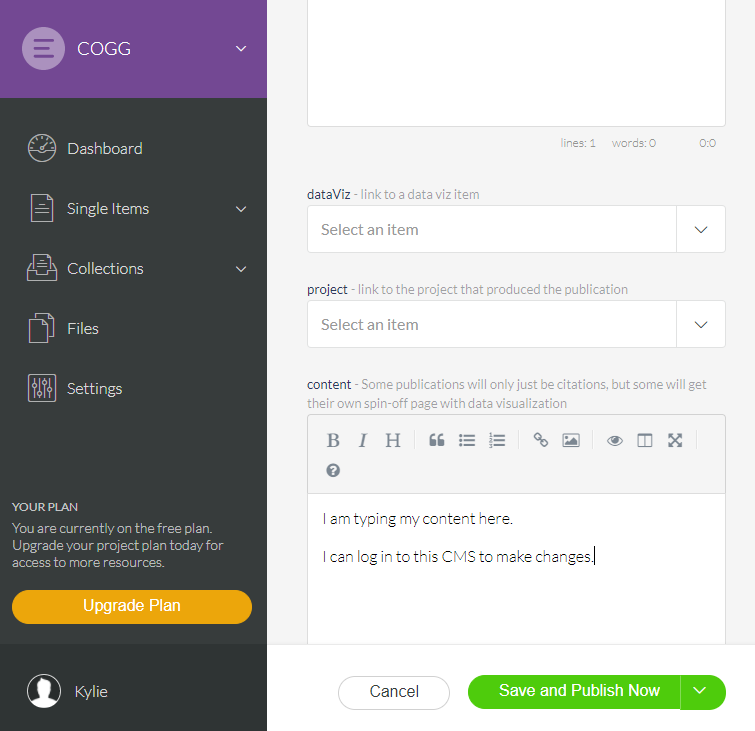

# Presention: Using a Content Management System (CMS) for COGG science sites

To run presentation locally, download zip file. Unzip it, and cd into it. 
```npm install```
```npm run serve```

This demo uses the [elemeno](elemeno.io) headless CMS. It is hosted online and provides an API to access the content. The key to access the API is saved in an untracked .config.js file. Either ask Kylie for the key or log into elemeno to get one for yourself.

